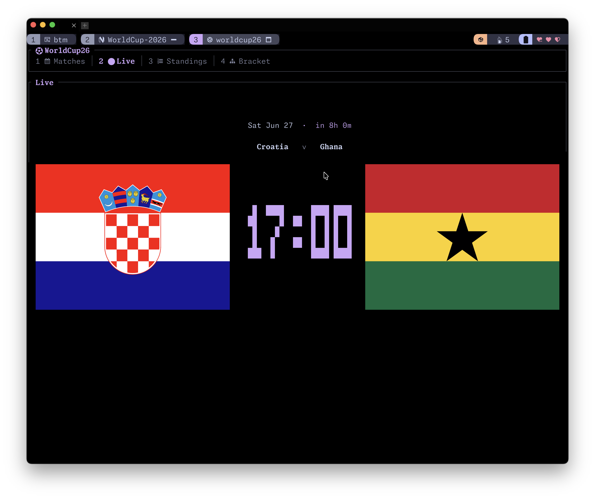
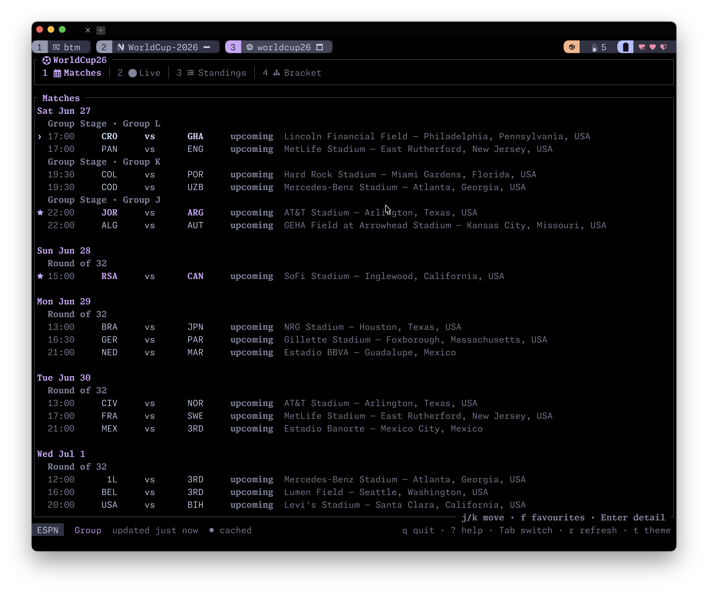
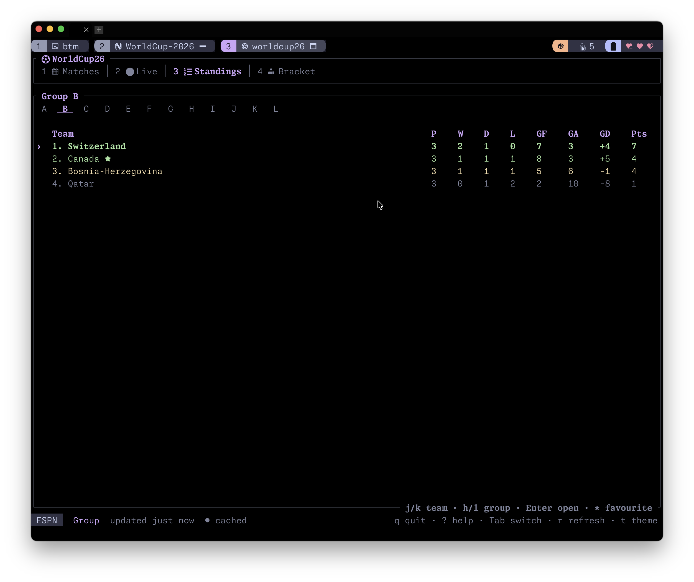
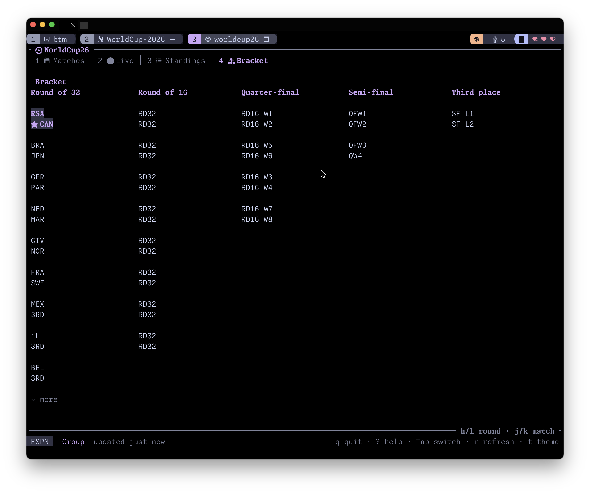

# WorldCup26 — World Cup 2026 TUI

A fast, keyboard-driven terminal UI for the **FIFA World Cup 2026**: schedule,
group standings, the knockout bracket, and a **live scoreboard** — built with
Rust and [ratatui](https://ratatui.rs).

> Status: under active development.



## Features

- **Matches** — fixtures by day and stage, status badges, local-timezone
  kickoff times, and favourite-team filtering; opens on the current (or next)
  game.
- **Live** — a glanceable "Live Activity" card: a large block-digit score
  flanked by real national flags (inline images on Kitty / Ghostty / WezTerm /
  iTerm2 / Sixel terminals; omitted on terminals without graphics support), the
  clock, and the most recent event; previews the next kickoff with a countdown
  when nothing is in play.
- **Standings** — the 12 group tables (A–L) with qualification highlighting,
  team-row navigation, and `Enter` to open a team view.
- **Team** — opened from Standings: a team's group summary, recent form, and
  full fixture list.
- **Bracket** — the knockout tree (Round of 32 → Final).
- **Match detail** — goals, cards, substitutions, lineups, and team stats.
- **Favourite teams** — star teams with `*` from Standings or the team view;
  favourites are highlighted (★) across every screen and can filter the Matches
  list.
- Real national **flags** on the Live card when the terminal supports graphics.
- Pluggable **data providers** (ESPN by default; API-Football and
  football-data.org optional), nine colour themes (including Catppuccin and a
  Government of Canada palette), an offline cache, and mouse support.

## Screenshots

Shown with the `catppuccin-mocha` theme, Nerd Fonts, and flags enabled (see the
[example config](#configuration)).



*Matches — fixtures by day and stage, with status badges, venues, and favourite (★) markers.*


*Live — a glanceable card with real national flags, a large block-digit score/clock, and a kickoff countdown.*



*Standings — the 12 group tables (A–L) with qualification highlighting and favourite teams starred.*



*Bracket — the knockout tree from the Round of 32 to the Final.*

## Installation

The crates.io package is named `worldcup26`; it installs the `worldcup26` command.

### Requirements

- Rust **1.95.0 or newer** with Cargo. Install it with
  [rustup](https://rustup.rs/) if you do not already have Rust.
- Native build tools for your OS:
  - macOS: `xcode-select --install`
  - Debian/Ubuntu: `sudo apt install build-essential`
  - Windows: Visual Studio Build Tools with the MSVC toolchain
- A terminal that supports standard TUI apps. Live flag images are shown only in
  graphics-capable terminals such as Kitty, Ghostty, WezTerm, Konsole, iTerm2, or
  Sixel-capable terminals; everything else works without graphics support.

Install the latest released version from crates.io:

```sh
cargo install worldcup26 --locked
worldcup26
```

If `worldcup26` is not found after installation, add Cargo's bin directory to your
`PATH` (`~/.cargo/bin` on macOS/Linux, `%USERPROFILE%\.cargo\bin` on Windows).

WorldCup26 uses ESPN by default and does not require an API key. Optional providers
can be enabled with `WORLDCUP26_API_FOOTBALL_KEY` or `WORLDCUP26_FOOTBALL_DATA_KEY`; see
[Data providers](#data-providers).

Common UI settings can be overridden inline for a single run:

```sh
worldcup26 --nerd-fonts --graphics auto
worldcup26 --theme catppuccin-mocha --timezone -4
```

### Run from source

```sh
cargo run -p worldcup26 --bin worldcup26
```

Requires the toolchain pinned in `rust-toolchain.toml`.

## Data providers

WorldCup26 normalizes several upstream APIs behind one interface:

| Provider           | API key | Notes                                          |
| ------------------ | ------- | ---------------------------------------------- |
| **ESPN** (default) | No      | Free, live data; the default.                  |
| API-Football       | Yes     | Richer stats; set `WORLDCUP26_API_FOOTBALL_KEY`.     |
| football-data.org  | Yes     | Limited live detail; set `WORLDCUP26_FOOTBALL_DATA_KEY`. |

Select a provider with `--provider <espn|api-football|football-data>` or in the
config file. UI settings can also be overridden inline with flags such as
`--nerd-fonts`, `--no-nerd-fonts`, `--flags`, `--no-flags`, `--theme <name>`,
`--timezone <local|utc|offset>`, and
`--graphics <auto|kitty|iterm2|sixel|halfblocks|off>`.

## Configuration

WorldCup26 reads an optional TOML config file. If it does not exist, built-in
defaults are used; pass `--config <path>` to use a specific file. The default
location is the platform config directory:

| Platform | Default path |
| -------- | ------------ |
| Linux    | `~/.config/worldcup26/config.toml` |
| macOS    | `~/.config/worldcup26/config.toml`, falling back to `~/Library/Application Support/dev.djensenius.worldcup26/config.toml` |
| Windows  | `%APPDATA%\djensenius\worldcup26\config\config.toml` |

If `XDG_CONFIG_HOME` is set, `$XDG_CONFIG_HOME/worldcup26/config.toml` takes
precedence on every platform. On macOS, a file at
`~/.config/worldcup26/config.toml` is used when present, otherwise the
`~/Library/Application Support` path above is used.

The full default configuration is:

```toml
favorites = []

[provider]
kind = "espn"

[ui]
theme = "world-night"
nerd_fonts = false
show_flags = false
timezone = "local"
```

An example with more features enabled — favourite teams, the Catppuccin Mocha
theme, Nerd Font glyphs, and national flags on the Live card (this is the setup
used for the [screenshots](#screenshots) above):

```toml
favorites = ["Canada", "Spain", "Argentina"]

[provider]
kind = "espn"

[ui]
theme = "catppuccin-mocha"
nerd_fonts = true
show_flags = true
timezone = "local"
```

Fields:

- `favorites` — teams (by display name or abbreviation, case-insensitive) to
  pin and highlight. Toggle in-app with `f`.
- `provider.kind` — data backend: `espn`, `api-football`, or `football-data`.
- `provider.api_football_key` / `provider.football_data_key` — API credentials
  for the paid providers (omitted by default). These can also be supplied via
  the `WORLDCUP26_API_FOOTBALL_KEY` and `WORLDCUP26_FOOTBALL_DATA_KEY`
  environment variables, which take precedence.
- `ui.theme` — colour theme name (cycle in-app with `t`); see
  [Keybindings](#keybindings).
- `ui.nerd_fonts` — use Nerd Font glyphs for icons.
- `ui.show_flags` — draw national flags on the Live card when the terminal
  supports graphics.
- `ui.timezone` — `"local"`, `"utc"`, or a fixed whole-hour offset from UTC as
  an integer (e.g. `-4`).

CLI flags such as `--provider`, `--theme`, `--timezone`, `--nerd-fonts` /
`--no-nerd-fonts`, and `--flags` / `--no-flags` override the file for a single
run without modifying it.

## Keybindings

| Key                 | Action                                  |
| ------------------- | --------------------------------------- |
| `1`–`4`             | Jump to a screen by number              |
| `Tab` / `Shift+Tab` | Next / previous screen                  |
| `j`/`k`, `↓`/`↑`    | Move selection                          |
| `Enter`             | Open match detail (team view on Standings) |
| `f`                 | Toggle favourites filter (Matches)      |
| `*`                 | Toggle favourite team (Standings, Team) |
| `h`/`l`, `←`/`→`    | Switch group / round                    |
| `r`                 | Refresh now                             |
| `t`                 | Cycle colour theme                      |
| `?`                 | Toggle help                             |
| `Esc`               | Back / close                            |
| `q`                 | Quit                                    |

The full list, including per-screen and mouse bindings, is in
[docs/keybindings.md](docs/keybindings.md).

## Workspace layout

- `crates/wc-data` — normalized domain model and provider backends.
- `crates/worldcup26` — the terminal UI (binary `worldcup26`).

## Documentation

- [Architecture](docs/architecture.md) — crates, data flow, polling, cache.
- [Data providers](docs/data-providers.md) — providers, API keys, configuration.
- [Keybindings](docs/keybindings.md) — full keyboard and mouse reference.

## Release automation

Releases are managed by
[release-please](https://github.com/googleapis/release-please). Conventional
Commits merged to `main` keep a Release PR open with the next version and
changelog entry. Merging that Release PR creates the GitHub release, then
dispatches the publish workflow.

For non-draft releases, CI publishes both crates to crates.io in dependency
order:

1. `wc-data`
2. `worldcup26` (installs the `worldcup26` binary)

Repository setup requires a crates.io API token stored as the
`CARGO_REGISTRY_TOKEN` GitHub Actions secret. The same publish workflow also
builds the release archives and Debian packages attached to the GitHub release.

## License

Apache-2.0. See [LICENSE](LICENSE).

Bundled national-flag artwork is from
[flag-icons](https://github.com/lipis/flag-icons) (MIT); see
[crates/worldcup26/assets/flags/ATTRIBUTION.md](crates/worldcup26/assets/flags/ATTRIBUTION.md).
